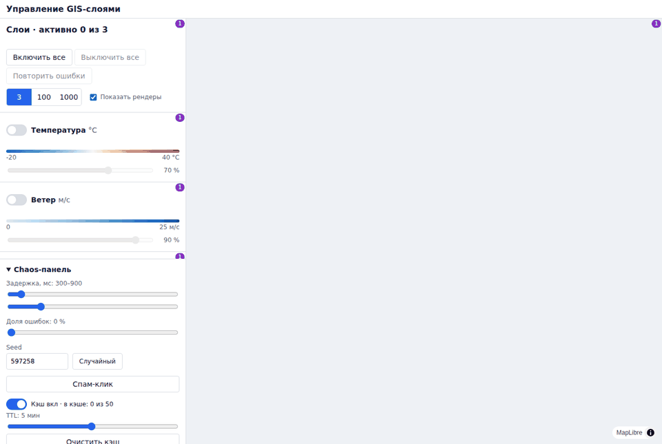
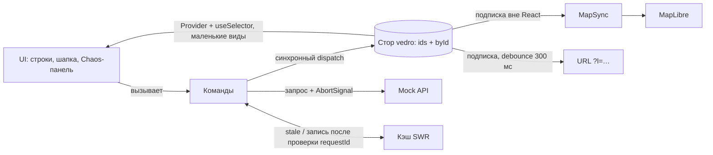

# Управление GIS-слоями

Панель картографических слоёв на React 19, vedro и MapLibre. Гонки при быстрых переключениях отсекаются двумя независимыми механизмами. Слайдер перерисовывает одну строку и ни разу — карту. На 1000 слоях любое действие в прогретом состоянии укладывается в 16 мс.

[](https://github.com/zalkar-mm/layers/actions/workflows/ci.yml)

**Live demo: https://symphonious-tarsier-00ed7e.netlify.app/** — собирается Netlify из последнего запушенного коммита.



## Как проверить за 2 минуты

Всё делается в [live demo](https://symphonious-tarsier-00ed7e.netlify.app/). На телефоне панели разнесены по вкладкам «Слои» и «Chaos».

1. **Рендеры.** Включите «Показать рендеры» в шапке панели. Нажмите «Включить все», дождитесь «Готово» и двигайте слайдер одного слоя: растёт счётчик только этой строки. Карта и соседние строки стоят на месте.
2. **Гонки.** В Chaos-панели нажмите «Спам-клик» — 20 переключений за 500 мс. В логе видны `запрос` и `abort`, итог совпадает с последним кликом. Включите «Сервер отвечает, несмотря на отмену» и повторите: в логе появится `отброшен (устаревший)` — сработала вторая защита.
3. **Кэш.** Выключите и включите загруженный слой: данные видны сразу, с бейджем «Обновление», затем «Готово».
4. **Масштаб.** Переключите «1000» и повторите шаг 1: всё так же, список виртуализирован. Вернитесь в «3» — слои восстановятся.
5. **Ссылка.** Откройте [ссылку с настроенными слоями](https://symphonious-tarsier-00ed7e.netlify.app/?l=temperature:70,wind:40): температура 70 %, ветер 40 %.

## Запуск

Нужны Node 24 (`.nvmrc`) и Corepack.

```bash
corepack enable
yarn          # установка
yarn dev      # http://localhost:5173
yarn test     # unit и компонентные тесты
yarn e2e      # Playwright; первый раз: yarn playwright install chromium
yarn check    # lint → steiger → typecheck → test → build
```

## Архитектура

Feature-Sliced Design: импорт только вниз, слайс отдаёт наружу только `index.ts`. Правило проверяют `eslint-plugin-boundaries` и steiger ([правила](docs/rules/architecture.md)).



| Слой | Что там |
|---|---|
| `app` | Роутер, тема, провайдеры сторов vedro; синхронизация с URL запускается в `main.tsx` |
| `pages/map-page` | Раскладка: карта и панели, вкладки на мобильном |
| `widgets` | `layer-panel`, `chaos-panel`, `map-view` (`MapSync` и стратегии отрисовки) |
| `features` | `layer-control`, `bulk-actions`, `chaos-settings`, `stress-mode`, `url-sync` |
| `entities/layer` | Модель, реестр, стор, селекторы и провайдеры, машина состояний, кэш, движок команд `layer-service` |
| `shared` | Mock API, привязка к vedro (`bindVedroStore`), счётчик рендеров, форматирование, UI-кит и тема |

В `src` только продакшн-код. Тесты — в `tests/`: `unit` повторяет структуру `src`, рядом `e2e` и `perf`. В папке не больше трёх файлов, остальное сгруппировано по назначению: например, `entities/layer/model/{state,store,selectors,loading}`.

## Состояние

- Стор — `{ ids, byId }`. Статика слоя (название, палитра, диапазон) — в реестре, не в сторе. Добавить слой = одна запись в [`base-layers.ts`](src/entities/layer/config/layers/base-layers.ts).
- Статус загрузки — discriminated union `idle | loading | success | error`. «Ошибка и данные одновременно» не компилируется.
- Structural sharing: изменение слоя создаёт новые объекты только для `byId` и этого слоя, остальные ссылки сохраняются.
- Подписка — штатный API vedro: `createVedro(store)` → `Provider` + `useSelector` ([ADR 009](docs/adr/009-standard-vedro-api.md)). `Provider` получает тот же стор, с которым работают команды.
- Селектор отдаёт маленький вид без GeoJSON: `useSelector` на каждый `dispatch` сериализует результаты всех селекторов (V3). На 1000 загруженных слоях движение слайдера — 3,3 мс, а с `LayerState` в селекторе — 3,5 с.
- Поверх `useSelector` — тонкая страховка от V4: значение сверяется со свежим `store.get()` на рендере и после подписки. Без неё строка могла застрять в «Загрузка…».

## Гонки и кэш

- **Отмена.** `AbortController` на слой: новая загрузка и выключение отменяют прошлый запрос.
- **Номер запроса.** Ответ пишется, только если слой ждёт именно его. Работает, даже если отмена не успела.
- **Кэш stale-while-revalidate.** Прошлые данные показываются, пока идёт новый запрос. TTL 5 минут, LRU на 50 записей, устаревший ответ в кэш не пишется.

Сценарии R1–R15 — в [`layer-service.test.ts`](tests/unit/entities/layer/model/loading/layer-service/layer-service.test.ts). Защиты проверены мутациями: удаление любой из них роняет тесты. Полная машина состояний — в [docs/design.md](docs/design.md#гонки-и-кэш).

## Рендеры

| Действие | Перерисовывается |
|---|---|
| Слайдер слоя | строка этого слоя |
| Вкл/выкл, ответ, ошибка | строка и шапка |
| «Включить все» | каждая строка ровно один раз |
| Любое действие | карта — никогда: `MapSync` меняет её вне React |

Каждая строка таблицы — тест со StrictMode. Полная таблица — в [docs/design.md](docs/design.md#рендеры).

## Карта

- `MapSync` подписан на стор вне React и меняет MapLibre напрямую ([ADR 005](docs/adr/005-map-sync-outside-react.md)).
- Всё, что зависит от вида отрисовки (`fill`, `arrows`, `heatmap`), — в картах `Record<LayerRenderKind, …>`: [`RENDER_KIND_TRAITS`](src/entities/layer/config/render-kind-traits.ts) и [`RENDER_STRATEGIES`](src/widgets/map-view/model/sync/render-strategies.ts). Вид без описания не компилируется ([ADR 010](docs/adr/010-render-strategies.md)).
- Порядок на карте: заливки → heatmap → стрелки. Heatmap строится по центроидам ячеек; в базовом наборе слоёв его пока нет.
- На карте — первые 10 включённых слоёв, ограничение показано на карте.

## Масштабирование

Режимы 3 · 100 · 1000 строятся через тот же реестр. От клика до commit на 1000 слоях, Chromium 141, 2 vCPU, разброс по трём прогонам, 28.09.2026:

| Действие | Время |
|---|---|
| Вкл/выкл слоя | 2,3–3,6 мс |
| Слайдер | 1,5–2,0 мс |
| «Включить все» | 6,7–9,2 мс |
| «Включить все», первый клик | 14,1–21,5 мс |
| «Выключить все» | 8,0–11,1 мс |

На 3 и 100 слоях все действия — до 5,5 мс. Цель задания — меньше 16 мс: выполнена для всех действий в прогретом состоянии. Первый клик «Включить все» — на границе и иногда выше: JIT ещё не прогрет. Как это достигнуто и история замеров — в [tests/perf/RESULTS.md](tests/perf/RESULTS.md).

## Находки по vedro

Подтверждены тестами на vedro 1.1.0 — [docs/vedro-findings](docs/vedro-findings/README.md).

- `useSelector` на каждый `dispatch` вызывает все селекторы и сериализует результат (V3). Селекторы отдают маленькие виды без данных слоя.
- `useSelector` подписывается в `useEffect` и теряет обновление до подписки (V4). Закрыто страховкой в `bindVedroStore`.
- `useDispatch` — новая функция на каждый рендер (V5). Не используется: изменения — командами.
- Результат async-колбэка `dispatch` в стор не попадает (V1). Вся асинхронность — в командах.
- Новый ключ верхнего уровня добавить нельзя (V2). Отсюда форма `ids + byId`.
- Повторная отписка от `@state` удаляет чужого подписчика (V6). Отписка сделана идемпотентной.

## Решения и компромиссы

[ADR](docs/adr/README.md):

- 001 — нормализованный стор;
- 002 — свой хук на `useSyncExternalStore` (заменён 009);
- 003 — один стор на все слои;
- 004 — отмена плюс номер запроса;
- 005 — карта вне React;
- 006 — кэш SWR;
- 007 — без React Compiler;
- 008 — движок команд в сущности;
- 009 — штатный API vedro со страховкой от V4;
- 010 — вид отрисовки через карты стратегий.

## AI в работе

Claude (Cowork) — основной агент: код, тесты, замеры. Субагенты — исследование и ревью. Журнал со всеми ошибками — [AI_LOG.md](AI_LOG.md), правила для агента — [CLAUDE.md](CLAUDE.md).

- **Исследование.** Разбор исходников vedro дал гипотезы V1–V7. Каждая проверена тестом, по ходу найдена N1: `get()` без ключа отдаёт новую копию.
- **Диагностика.** Прод-сборка падала при зелёных тестах: CommonJS-пакет vedro в Rolldown. Карта не рисовала слои: воркер MapLibre не собирался. Найдено по консоли и снимкам экрана.
- **Производительность.** CPU-профили в Chromium нашли стек на каждой отмене запроса и O(n²) при загрузке 1000 слоёв. Оба места исправлены, есть замеры до и после.
- **Ревью.** Субагент со свежим контекстом несколько раз проверял код. Каждую находку AI перепроверил, прежде чем исправлять. Ревью по внешнему своду правил кода нашло, что `heatmap` молча рисовался заливкой.
- **Где AI ошибся.** Замер «селектор против хука» сначала показал равенство — слои были пустыми. Первый perf-замер не включал коммит React. При переходе на штатный API ревьюер поймал удалённый тест V4 и вернувшуюся потерю обновлений. При рефакторинге тач-зоны 44 px перекрыли соседние кнопки — теперь это ловит e2e-зонд. Подробно — в журнале.

## Что сделал бы дальше

- Реальный API вместо mock: заменить фабрику в `entities/layer/api`, команды не меняются.
- Кэш в IndexedDB между сессиями.
- WebSocket-обновления слоёв поверх той же машины состояний.
- Векторные тайлы вместо GeoJSON для больших сеток.

## Документация

| Что | Где |
|---|---|
| Подробное устройство: машина состояний, бюджет рендеров | [docs/design.md](docs/design.md) |
| Замеры производительности | [tests/perf/RESULTS.md](tests/perf/RESULTS.md) |
| Архитектурные решения | [docs/adr](docs/adr/README.md) |
| Правила кода, тестов, архитектуры | [docs/rules](docs/rules/README.md) |
| Матрица «пункт ТЗ → тест» | [docs/test-matrix.md](docs/test-matrix.md) |
| Проверка гипотез по vedro | [docs/vedro-findings](docs/vedro-findings/README.md) |
| Техническое задание | [docs/TZ.md](docs/TZ.md) |
| Журнал работы с AI | [AI_LOG.md](AI_LOG.md) |
