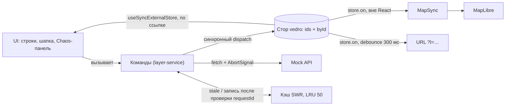

# Управление GIS-слоями

Панель картографических слоёв на React 19 + vedro + MapLibre: гонки при быстрых переключениях отсекаются двумя независимыми механизмами, движение слайдера перерисовывает одну строку и ноль раз карту, 1000 слоёв работают так же, как 3.

**Live demo:** появится после публикации репозитория (деплой на GitHub Pages настроен в `.github/workflows/deploy.yml`).
**CI:** `.github/workflows/ci.yml` — lint, steiger, typecheck, unit, build, e2e. Бейдж — после публикации репозитория.


## Как проверить за 2 минуты

1. Включите «Показать рендеры» в шапке панели — у строк, шапки и легенды карты появятся фиолетовые счётчики.
2. Нажмите «Включить все», дождитесь «Готово» и двигайте слайдер прозрачности одного слоя — растёт счётчик только этой строки. Счётчики карты и остальных строк стоят на месте.
3. В Chaos-панели нажмите «Спам-клик» — 20 переключений за 500 мс. В логе видны `запрос` и `abort` — первая защита от гонок, отмена. Итоговое состояние слоя совпадает с последним кликом. Если слой до этого успел загрузиться, при включениях видно `из кэша`.
   Включите «Сервер отвечает, несмотря на отмену» и повторите: отменённые запросы всё равно приходят, и в логе появляется `отброшен (устаревший)` — вторая защита, проверка номера запроса. Состояние слоя при этом не меняется.
4. Выключите и снова включите загруженный слой — данные видны сразу, бейдж «Обновление · данные …», затем «Готово». Это кэш stale-while-revalidate.
5. Переключите «1000» и повторите шаг 2 — счётчики ведут себя так же, список виртуализирован. Скопируйте адрес страницы в режиме 3 — ссылка восстанавливает слои и прозрачность.

## Запуск

Нужны Node 24 (`.nvmrc`) и Corepack.

```bash
corepack enable
yarn            # установка
yarn dev        # dev-сервер
yarn test       # unit и компонентные тесты
yarn e2e        # Playwright; первый раз: yarn playwright install chromium
yarn check      # lint → steiger → typecheck → test → build
```

## Архитектура

Feature-Sliced Design, импорт только вниз, наружу слайс отдаёт только `index.ts`. Проверяется `eslint-plugin-boundaries` и steiger. Правила — [docs/rules/architecture.md](docs/rules/architecture.md).



| Слой | Что там |
|---|---|
| `entities/layer` | Модель, реестр, стор, хуки, машина состояний, кэш, движок команд ([ADR 008](docs/adr/008-command-engine-in-entity.md)) |
| `features` | `layer-control`, `bulk-actions`, `chaos-settings`, `stress-mode`, `url-sync` |
| `widgets` | `layer-panel`, `chaos-panel`, `map-view` (с `MapSync`) |
| `shared` | mock API, привязки vedro, счётчик рендеров, UI-кит |

## Состояние

Стор vedro — `{ ids, byId }` ([ADR 001](docs/adr/001-normalized-store.md)). Отдельный ключ на слой невозможен: vedro не даёт добавлять ключи верхнего уровня (V2). Статика слоя (название, палитра, диапазон) — в реестре, не в сторе. Добавить слой = одна запись в `entities/layer/config/base-layers.ts`, больше правок нигде нет.

Статус загрузки — discriminated union: `idle | loading | success | error`. «Ошибка и данные одновременно» не компилируется, `stale: CachedData | null` обязателен в `loading` и `error` — это проверено тестами типов.

Structural sharing: изменение слоя A создаёт новые объекты только для `byId` и `byId[A]`. Ссылки остальных слоёв и `ids` сохраняются (R9). На этом держится бюджет рендеров.

Компоненты подписаны своими хуками на `useSyncExternalStore`, а не штатным `useSelector` ([ADR 002](docs/adr/002-use-sync-external-store.md)). Штатный на каждый `dispatch` вызывает все селекторы и сериализует их результаты — на 1000 загруженных слоях это 1148 мс на одно движение слайдера против 0,73 мс у своего хука ([замер](perf/RESULTS.md)).

## Гонки и кэш

Два независимых механизма ([ADR 004](docs/adr/004-race-protection.md)):

- `AbortController` на слой — новая загрузка и выключение отменяют прошлый запрос;
- `requestId` — ответ пишется, только если слой ждёт именно его. Работает, даже если abort не успел (R8).

`AbortError` — не ошибка: слой не уходит в `error`, счётчик попыток не растёт. Проверено мутациями: без проверки `requestId` падают R1 и R8, без abort — R5 и R6, с записью в кэш до проверки — R12.

Кэш stale-while-revalidate вне стора ([ADR 006](docs/adr/006-swr-cache.md)): запрос при включении идёт всегда (так требует задание), а прошлые данные показываются, пока он идёт. TTL 5 минут, LRU на 50 записей, устаревший ответ в кэш не пишется никогда.

| Текущее состояние | Событие | Новое состояние | Побочный эффект |
|---|---|---|---|
| выкл / idle, кэша нет | enable | вкл / loading(r1, stale=null) | запрос r1 |
| выкл / idle, кэш свежий | enable | вкл / loading(r1, stale=кэш) | запрос r1, событие «из кэша» |
| выкл / idle, кэш просрочен | enable | вкл / loading(r1, stale=null) | запрос r1, запись кэша удалена |
| вкл / loading(r1) | disable | выкл / idle | abort r1 |
| вкл / loading(r1) | ответ r1 | вкл / success | запись в кэш |
| вкл / loading(r1) | ошибка r1 | вкл / error(attempt+1, stale сохранён) | — |
| вкл / loading(r2) | ответ r1 (устаревший) | без изменений | ответ отброшен, в кэш не пишется |
| вкл / error | retry | вкл / loading(r2, stale сохранён, если не просрочен) | запрос r2 |
| вкл / error | disable | выкл / idle | attempt сброшен |
| вкл / success | refresh | вкл / loading(r2, stale=текущие данные) | запрос r2 |
| вкл / success | disable | выкл / idle | данные уходят из стора, остаются в кэше |
| вкл / loading | retry / refresh | без изменений | команда игнорируется |
| любое | setOpacity | то же + новая opacity | — |

Тесты R1–R15 — [`layer-service.test.ts`](src/entities/layer/model/layer-service.test.ts), на фейковых таймерах, без UI.

## Рендеры

Каждая строка таблицы — отдельный тест ([`layer-panel.test.tsx`](src/widgets/layer-panel/ui/layer-panel.test.tsx), [`map-view.test.tsx`](src/widgets/map-view/ui/map-view.test.tsx)) со StrictMode.

| Действие | Перерисовывается | Не перерисовывается |
|---|---|---|
| Слайдер слоя A | строка A | остальные строки, шапка, панель, карта, легенда |
| Вкл слоя A | строка A, шапка | остальные строки, панель |
| Ответ API для A | строка A, шапка | остальные строки |
| Ошибка A → retry | строка A, шапка | остальные строки |
| Вкл A из кэша | строка A: ровно 2 рендера (loading со stale, success) | остальные строки |
| Тик «N мин назад» | только бейдж статуса A | строка, шапка, соседи |
| `enableAll` | каждая строка ровно 1 раз на изменение | повторные рендеры строки |
| То же в режиме 1000 | то же | то же, плюс виртуализация |

Замер в браузере (Chromium 141, прод-сборка, облачная машина 2 vCPU — [подробности](perf/RESULTS.md)): на 1000 слоях переключение слоя — 1,7–3,1 мс, слайдер — 1,2–1,3 мс от dispatch до commit.

Карта рендерится ровно один раз: `MapSync` вне React вызывает `setPaintProperty` на движение слайдера и больше ничего ([ADR 005](docs/adr/005-map-sync-outside-react.md)). React Compiler не используется — мемоизация видна в коде и доказана тестами ([ADR 007](docs/adr/007-no-react-compiler.md)).

## Масштабирование

Стресс-режим 3 · 100 · 1000 строится через тот же реестр. При возврате в набор слоёв он восстанавливается в том виде, в каком его оставили: включённые слои и прозрачность. Данные берутся из кэша, поэтому видны сразу с бейджем «Обновление». Ссылка на реальные слои не затирается. Один стор, а не стор на слой ([ADR 003](docs/adr/003-single-store.md)): подписчики читают снимок по ссылке за O(1), шардинг решал бы несуществующую проблему.

От dispatch до commit, разброс по трём прогонам:

| Слоёв | Вкл/выкл слоя | Слайдер | `enableAll` | `disableAll` |
|---|---|---|---|---|
| 3 | 1,6–2,1 мс | 0,6–0,7 мс | 1,4–1,9 мс | 1,2–1,4 мс |
| 100 | 1,4–2,3 мс | 0,8 мс | 2,2–2,4 мс | 2,4–4,0 мс |
| 1000 | 1,7–3,1 мс | 1,2–1,3 мс | 4,4–7,4 мс (первый клик 12,5–16,5) | 5,7–9,2 мс |

Цель §10.3 «< 16 мс на 1000 слоях» выполнена для всех действий. Массовые команды на 1000 слоях были 17 и 23 мс; две правки довели их до 5–9 мс:

- `disableAll`: `abort()` без аргумента создаёт `DOMException` со стеком на каждый вызов, и mock создавал ещё один. Теперь у сервиса одна причина отмены на все запросы, а mock, как настоящий `fetch`, отклоняет промис с `signal.reason`.
- `enableAll`: 1000 запусков запросов шли между dispatch и commit. От 50 запросов их старт откладывается в следующую задачу — пользователь сначала видит состояние loading. Одиночные команды остаются синхронными.

Первый клик `enableAll` медленнее: JIT ещё не прогрет. Список виртуализируется с 50 строк, на карте — первые 10 включённых слоёв (ограничение показано на карте).

## Находки по vedro

Все проверены тестами на vedro 1.1.0 и React 19 — [docs/vedro-findings](docs/vedro-findings/README.md), со ссылками на строки исходников.

| # | Поведение | Как учтено |
|---|---|---|
| V1 | Результат async-колбэка `dispatch` в стор не попадает | Асинхронность — в командах, `dispatch` синхронный |
| V2 | Новый ключ верхнего уровня через колбэк/объект — исключение | `ids + byId` |
| V3 | `useSelector` на каждый `dispatch` вызывает все селекторы и `JSON.stringify` | Свои хуки, сравнение по ссылке |
| V4 | `useSelector` подписывается в `useEffect`: селектор замерзает, обновление до подписки теряется | `useSyncExternalStore` |
| V5 | `useDispatch` — новая функция на каждый рендер | `dispatch` не передаётся пропсами |
| V6 | Повторная отписка от `@state` удаляет чужого подписчика | Идемпотентная отписка |
| V7 | `store.on(key)` работает вне React | `MapSync`, синхронизация URL |
| N1 | `get()` без ключа — новая копия на каждый вызов | Снимок хуков — `get('byId')` |

Ещё одна особенность: vedro — CommonJS-пакет, и в прод-сборке Rolldown отдаёт объект `exports` вместо класса. Сторы создаются через адаптер `createVedroStore`.

## Решения и компромиссы

[docs/adr](docs/adr/README.md): 001 нормализованный стор · 002 свой хук на `useSyncExternalStore` · 003 один стор · 004 abort + requestId · 005 карта вне React · 006 кэш SWR · 007 без React Compiler · 008 движок команд в сущности.

## AI в работе

Инструмент — Claude (Cowork): основной агент пишет код и тесты, субагенты — исследование и ревью. Полный журнал с ошибками — [AI_LOG.md](AI_LOG.md), правила для агента — [CLAUDE.md](CLAUDE.md) и [docs/rules](docs/rules/README.md).

- **Исследование.** Три субагента параллельно разобрали документацию и конфиги моих прошлых проектов — из них собраны правила и инфраструктура. Разбор исходников vedro дал гипотезы V1–V7; каждая проверена тестом, по ходу найдена N1, которая изменила устройство хуков.
- **Диагностика.** Прод-сборка падала сразу при запуске, хотя 134 теста были зелёными: CJS-interop vedro. Карта не рисовала слои: воркер MapLibre 6 не собирался, а CSS MapLibre схлопывал контейнер в высоту 0. Всё найдено первым запуском в браузере по консоли и снимкам экрана.
- **Проектирование.** Движок команд вынесен в сущность, чтобы одиночные и массовые команды делили один набор abort-контроллеров (ADR 008). Запись в URL — мимо роутера, чтобы слайдер не рендерил страницу.
- **Проверка тестов.** Когда тесты гонок прошли с первого раза, AI проверил их мутациями — удалял каждую защиту и смотрел, что тесты падают.
- **Code review.** Три ревью субагентом со свежим контекстом. Найдены, например, рассинхронизация запросов при синхронном подписчике стора, тест V4, который не ловил проблему, порча ссылки в стресс-режиме, вторая карта в StrictMode. Каждую находку AI перепроверил и исправил.
- **Где AI ошибся.** Первый замер «штатный селектор против своего хука» показал равенство, потому что слои были пустыми; с данными — разница в 1500 раз. Ссылка на настоящий `Date.now` в синглтоне обходила фейковые таймеры. Ожидание «2 рендера шапки» оказалось неверным, а код — верным. Подробности и другие ошибки — в журнале.

## Что сделал бы дальше

- Реальный API вместо mock: заменить фабрику в `entities/layer/api` — команды не меняются.
- Кэш в IndexedDB между сессиями.
- WebSocket-обновления слоёв поверх той же машины состояний.
- Векторные тайлы вместо GeoJSON для больших сеток.
- Замеры на реальном устройстве пользователя, а не в облачной машине.
